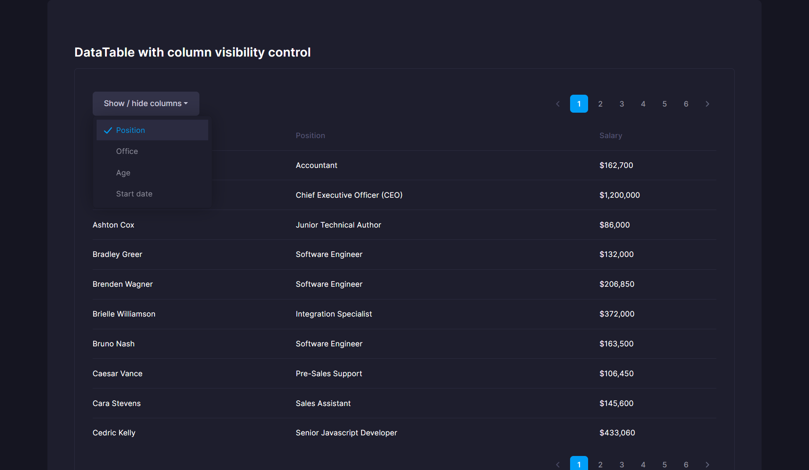
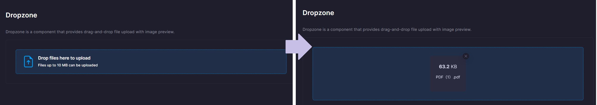
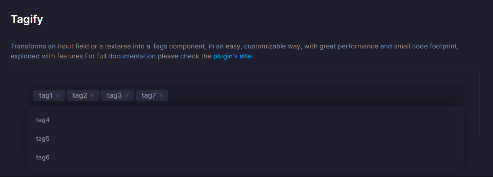

# Changelog
All notable changes to this project will be documented in this file.

# [1.0.22] - 2023/1/30
### Changed
- Changed the default value of the reset page of the reload method of the data table component from true to false.

# [1.0.21] - 2023/1/30
### Changed
- Added a page reset parameter to the reload method of the Datatable component.  
    The default value for page reset is true.
    ```js
    const myDatatable = new Datatable(ref.myDatatable);

    // Reload. Page position after reload is 1.
    colvisDatatable.reload(true);

    // Reload the page while maintaining the current page position.
    colvisDatatable.reload(false);
    ```

# [1.0.20] - 2023/1/24
### Added
- Add column reference methods to DataTable class (Datatable.column(columnSelector: any, modifier?: DataTables.ObjectSelectorModifier): DataTables.ColumnMethods).
    HTML:
    ```html
    <table data-ref="myDatatable" class="table table-row-bordered gy-5">
      <thead>
        <tr class="fw-semibold fs-6 text-muted">
          <th>Name</th>
          <th>Position</th>
          <th>Office</th>
          <th>Age</th>
          <th>Start date</th>
          <th>Salary</th>
        </tr>
      </thead>
      <tbody></tbody>
    </table>
    ```

    JS:
    ```js
    const myDatatable = new Datatable(ref.myDatatable);

    // Hide the second column.
    colvisDatatable.column(1).visible(false);
    ```

# [1.0.19] - 2023/1/23
### Added
- Added example of data table switching column visibility.  
    See the DataTable section of [this page](https://takuya-motoshima.github.io/metronic-extension/) for a demonstration.  
    

    HTML:
    ```html
    <table data-ref="myDatatable" class="table table-row-bordered gy-5">
      <thead>
        <tr class="fw-semibold fs-6 text-muted">
          <th>Name</th>
          <th>Position</th>
          <th>Office</th>
          <th>Age</th>
          <th>Start date</th>
          <th>Salary</th>
        </tr>
      </thead>
      <tbody></tbody>
    </table>
    ```

    JS:
    ```js
    import {Datatable, selectRef} from 'metronic-extension';

    function initDatatable() {
      new Datatable(ref.myDatatable, {
        ajax: {
          url: 'http://localhost:8080/api/persons'
        }
        dom: `<'row align-items-center'<'col-auto'B><'col dataTables_pager'p>><'row'<'col-12'tr>><'row'<'col-12 dataTables_pager'p>>`,
        columnDefs: [
          {targets: 0, data: 'name'},
          {targets: 1, data: 'position'},
          {targets: 2, data: 'office'},
          {targets: 3, data: 'age'},
          {targets: 4, data: 'startDate'},
          {targets: 5, data: 'salary'}
        ],
        buttons: [
          {
            extend: 'colvis',
            text: 'Show / hide columns',
            // Columns selector that defines the columns to include in the column visibility button set.
            // CSS selectors, column indexes, etc. can be used to specify columns to switch visibility.
            columns: ':eq(1),:eq(2),:eq(3),:eq(4)',
            // columns: [1,2,3,4],
          }
        ],
        stateSave: true,// Save the column visibility in the browser.
        stateSaveParams: (_, data) => {
          // Remove items not to be saved in the browser.
          delete data.length;
          delete data.order;
          delete data.paging;
          delete data.scroller;
          delete data.search;
          delete data.searchBuilder;
          delete data.searchPanes;
          delete data.select;
        }
      });
    }

    const ref = selectRef();
    initDatatable();
    ```

## [1.0.18] - 2023/1/10
### Changed
- The bootstrap tooltip setup function (initTooltip) now returns a tooltip object (bootstrap.Tooltip[]).

## [1.0.17] - 2023/1/8
### Changed
- Fixed an error that occurred in the process of extending the ajax option of a DataTable when the ajax option is a URL string.

## [1.0.16] - 2023/1/8
### Fixed
- Fixed a bug that prevented importing ESM modules directly without using the bundling tool as follows.
    ```js
    import * as extension from './node_modules/metronic-extension/dist/build.esm.js';
    ```

## [1.0.15] - 2022/11/24
### Changed
- Added an event handler to the Dropzone component that fires when a selected file is canceled.
    HTML:
    ```html
    <h1 id="dropzone">Dropzone</h1>
    ```

    JS:
    ```js
    import {Dropzone} from 'metronic-extension';
    const dropzone = new Dropzone(document.getElementById('dropzone'));
    dropzone
      .onAddFile(file => {
        alert(`From additional handlers. Select "${file.name}"`);
      })
      .onCancelFile(() => {
        alert('Canceled file selection');
      });
    ```

## [1.0.14] - 2022/11/21
### Changed
- Added a method to the modal class to determine if the modal is currently visible (Modal#isShowing(): boolean).
    ```js
    import {Modal} from 'metronic-extension';

    class DemoModal extends Modal {
      init() {
        const node = this.#render();
        const instance = new bootstrap.Modal(node);
        return [node, instance];
      }

      #render() {
        return $(
          `<div class="modal fade" tabindex="-1" aria-hidden="true">
            <!--begin::Modal dialog-->
            <div class="modal-dialog modal-dialog-centered mw-650px">
              <!--begin::Modal content-->
              <div class="modal-content">
                <!--begin::Modal header-->
                <div class="modal-header">
                  <!--begin::Modal title-->
                  <h2>Demo Modal</h2>
                  <!--end::Modal title-->
                  <!--begin::Close-->
                  <div class="btn btn-sm btn-icon btn-active-color-primary" data-bs-dismiss="modal">
                    <!--begin::Svg Icon | path: icons/duotune/arrows/arr061.svg-->
                    <span class="svg-icon svg-icon-1"><svg width="24" height="24" viewBox="0 0 24 24" fill="none" xmlns="http://www.w3.org/2000/svg">
                      <rect opacity="0.5" x="6" y="17.3137" width="16" height="2" rx="1" transform="rotate(-45 6 17.3137)" fill="currentColor" />
                      <rect x="7.41422" y="6" width="16" height="2" rx="1" transform="rotate(45 7.41422 6)" fill="currentColor" />
                    </svg></span>
                    <!--end::Svg Icon-->
                  </div>
                  <!--end::Close-->
                </div>
                <!--end::Modal header-->
                <!--begin::Modal body-->
                <div class="modal-body py-lg-10 px-lg-10">Hello, world</div>
                <!--end::Modal body-->
                <!--begin::Modal footer-->
                <div class="modal-footer">
                  <button type="button" class="btn btn-light" data-bs-dismiss="modal">Close</button>
                </div>
                <!--end::Modal footer-->
              </div>
              <!--end::Modal content-->
            </div>
            <!--end::Modal dialog-->
          </div>`).appendTo('body');
      }
    }

    const demoModal = new DemoModal();
    demoModal.isShowing();// =>false
    demoModal.show();
    demoModal.isShowing();// =>true
    ```

## [1.0.13] - 2022/11/18
### Changed
- The default and current images for the image input component (ImageInput) options can now be initially set with the data attribute.  
    HTML:
    ```html
    <div id="imageInput"
      data-image-input-current="img/current.jpg"
      data-image-input-default="img/default.jpg"></div>
    <input type="hidden" id="selectedImageDataUrl">
    ```

    JS:
    ```js
    import {ImageInput} from 'metronic-extension';

    const imageInput1 = new ImageInput(document.getElementById('imageInput'), {
      // The current and default image is specified by the data attribute. Of course, you can optionally specify it.
      // current: 'img/current.jpg',
      // default: 'img/default.jpg',
      hiddenEl: document.getElementById('selectedImageDataUrl'),
      language: {
        change: 'Change',
        remove: 'Delete',
        cancel: 'Cancel change'
      }
    });
    ```

## [1.0.12] - 2022/11/18
### Changed
- Added support for build scripts on Windows OS.

### Fixed
- Fixed a bug that the DataURL of the current image specified in the image input component (ImageInput.ts) was not set to the hidden element.

## [1.0.11] - 2022/11/17
### Added
- Add a component to toggle password visibility (initShowPasswordToggle).  
    The component is applied to input elements with the &quot;[data-show-password-toggle=&quot;true&quot;]&quot; attribute.  
    

    HTML:
    ```html
    <!--begin::Input group-->
    <div class="d-flex flex-column mb-7 fv-row">
      <!--begin::Label-->
      <label class="required fs-6 fw-bolder mb-2">Password</label>
      <!--end::Label-->
      <!--begin::Input group-->
      <div class="input-group input-group-solid">
        <!--begin::Input-->
        <input id="input" data-show-password-toggle="true" class="form-control" type="password" placeholder="Enter password..." />
        <!--end::Input-->
        <!--begin::Button-->
        <button type="button" class="btn btn-icon btn-light"></button>
        <!--end::Button-->
      </div>
      <!--end::Input group-->
    </div>
    <!--begin::Input group-->
    ```

    JS:
    ```js
    import {initShowPasswordToggle} from 'metronic-extension';

    initShowPasswordToggle(document.getElementById('input'));
    
    //  or context is specified, the component is applied to the target of the child element.
    initShowPasswordToggle(document.body);
    ```

## [1.0.10] - 2022/11/15
### Added
- Added a tag change event (fired when a tag is added or removed) to the Tagify component.
    HTML:
    ```html
    <input id="tagify" class="form-control" value="tag1,tag2,tag3" />
    ```

    JS:
    ```js
    import {Tagify} from 'metronic-extension';
    const tagify = new Tagify(document.getElementById('tagify'), {
      whitelist: ['tag1', 'tag2', 'tag3', 'tag4', 'tag5', 'tag6', 'tag7'],
      dropdown: {maxItems: 20}
    });
    tagify
      .onAddTag(evnt => alert('Add tags'))
      .onRemoveTag(evnt => alert('Delete tag'))
      .onChangeTag(evnt => alert('Change (add or remove) a tag'));
    ```

## [1.0.9] - 2022/11/14
### Added
- Added Dropzone component.
    

## [1.0.8] - 2022/11/14
### Changed
- Add docs/ to .npmignore.

## [1.0.7] - 2022/11/14
### Fixed
- Remove node_modules in docs that were accidentally included in the package.

## [1.0.6] - 2022/11/14
### Added
- Add Tagify (src/components/Tagify) component.
    

## [1.0.5] - 2022/10/24
###  Added
- Added Japanese phone number custom validation to form validation.  
    HTML:
    ```html
    <!--begin::Form-->
    <form data-ref="customValidationForm" autocomplete="off">
      <!--begin::Input group-->
      <div class="fv-row mb-10">
        <!--begin::Label-->
        <label class="fw-semibold fs-6 mb-2">Integer from 1 to 99</label>
        <!--end::Label-->
        <!--begin::Input-->
        <input name="betweenValues" class="form-control" placeholder="99" value="99">
        <!--end::Input-->
      </div>
      <!--end::Input group-->
      <!--begin::Actions-->
      <button type="submit" class="btn btn-primary">Validation Form</button>
      <!--end::Actions-->
    </form>
    <!--end::Form-->
    ```

    JS:
    ```js
    import {selectRef, Validation} from 'metronic-extension';

    const ref = selectRef();
    const validation = new Validation(ref.customValidationForm, {
      betweenValues: {
        validators: {
          isIntegersBetween: {
            message: 'This is not correct.',
            min: 1,
            max: 99
          }
        }
      }
    });
    validation.onValid(() => {
      alert('Form has been successfully submitted!');
    });
    ```

## [1.0.4] - 2022/10/24
### Added
- Added event handler that fire when each field is valid or invalid.
    ```js
    import {Validation} from 'metronic-extension';

    const validation = new Validation(document.getElementById('demoForm'), {
      userName: {
        validators: {
          notEmpty: {message: 'Enter here.'}
        }
      }
    });
    validation
      .onValid(async () => {
        // All fields are valid.
      })
      .onFieldValid(name => {
        console.log(`${name} field is valid`);
        // =>userName field is valid
      })
      .onFieldInvalid(name => {
        console.log(`${name} field is invalid`);
        // =>userName field is invalid
      });
    ```
- Add a method to immediately validate the specified field.
    ```js
    import {Validation} from 'metronic-extension';

    const validation = new Validation(document.getElementById('demoForm'), {
      userName: {
        validators: {
          notEmpty: {message: 'Enter here.'}
        }
      }
    });

    // Returns true if userName is valid, false if invalid.
    const isValid =await validation.validateField('userName');
    ```

## [1.0.3] - 2022/10/24
### Added
- Added Japanese phone number custom validation to form validation.  
    HTML:
    ```html
    <!--begin::Form-->
    <form data-ref="customValidationForm" autocomplete="off">
      <!--begin::Input group-->
      <div class="fv-row mb-10">
        <!--begin::Label-->
        <label class="fw-semibold fs-6 mb-2 required">Japanese phone number</label>
        <!--end::Label-->
        <!--begin::Input-->
        <input name="phoneNumberJp" class="form-control" placeholder="06-6012-3456" value="06-6012-3456">
        <!--end::Input-->
      </div>
      <!--end::Input group-->
      <!--begin::Actions-->
      <button type="submit" class="btn btn-primary">Validation Form</button>
      <!--end::Actions-->
    </form>
    <!--end::Form-->
    ```

    JS:
    ```js
    import {selectRef, Validation} from 'metronic-extension';

    const ref = selectRef();
    const validation = new Validation(ref.customValidationForm, {
      phoneNumberJp: {
        validators: {
          notEmpty: {message: 'Enter here.'},
          isPhoneNumberJp: {message: 'This is not correct.'}
        }
      }
    });
    validation.onValid(() => {
      alert('Form has been successfully submitted!');
    });
    ```

## [1.0.2] - 2022/10/24
### Added
- Add request error hook method to API class.
    ```js
    import {Api} from 'metronic-extension';

    export default class extends Api {
      requestErrorHook(code) {
        if (code === 403) {
          // Redirect in case of authentication error (403).
          alert('The session has expired');
          location.replace('/');
        }
      }
    }
    ```
- Added request error hook method to Datatable class.
    ```js
    import {Datatable} from 'metronic-extension';

    export default class extends Datatable {
      requestErrorHook(code) {
        if (code === 403) {
          // Redirect in case of authentication error (403).
          alert('The session has expired');
          location.replace('/');
        }
      }
    }
    ```
### Fixed
- Fix to prevent tooltip elements from being double instantiated. (src/components/initTooltip.ts)

## [1.0.1] - 2022/10/20
### Fixed
- Removed boostrap from this package which conflicts with metronic's bootstrap.

## [1.0.0] - 2022/10/17
### Added
- Released.

[1.0.1]: https://github.com/takuya-motoshima/metronic-extension/compare/v1.0.0...v1.0.1
[1.0.2]: https://github.com/takuya-motoshima/metronic-extension/compare/v1.0.1...v1.0.2
[1.0.3]: https://github.com/takuya-motoshima/metronic-extension/compare/v1.0.2...v1.0.3
[1.0.4]: https://github.com/takuya-motoshima/metronic-extension/compare/v1.0.3...v1.0.4
[1.0.5]: https://github.com/takuya-motoshima/metronic-extension/compare/v1.0.4...v1.0.5
[1.0.6]: https://github.com/takuya-motoshima/metronic-extension/compare/v1.0.5...v1.0.6
[1.0.7]: https://github.com/takuya-motoshima/metronic-extension/compare/v1.0.6...v1.0.7
[1.0.8]: https://github.com/takuya-motoshima/metronic-extension/compare/v1.0.7...v1.0.8
[1.0.9]: https://github.com/takuya-motoshima/metronic-extension/compare/v1.0.8...v1.0.9
[1.0.10]: https://github.com/takuya-motoshima/metronic-extension/compare/v1.0.9...v1.0.10
[1.0.11]: https://github.com/takuya-motoshima/metronic-extension/compare/v1.0.10...v1.0.11
[1.0.12]: https://github.com/takuya-motoshima/metronic-extension/compare/v1.0.11...v1.0.12
[1.0.13]: https://github.com/takuya-motoshima/metronic-extension/compare/v1.0.12...v1.0.13
[1.0.14]: https://github.com/takuya-motoshima/metronic-extension/compare/v1.0.13...v1.0.14
[1.0.15]: https://github.com/takuya-motoshima/metronic-extension/compare/v1.0.14...v1.0.15
[1.0.16]: https://github.com/takuya-motoshima/metronic-extension/compare/v1.0.15...v1.0.16
[1.0.17]: https://github.com/takuya-motoshima/metronic-extension/compare/v1.0.16...v1.0.17
[1.0.18]: https://github.com/takuya-motoshima/metronic-extension/compare/v1.0.17...v1.0.18
[1.0.19]: https://github.com/takuya-motoshima/metronic-extension/compare/v1.0.18...v1.0.19
[1.0.20]: https://github.com/takuya-motoshima/metronic-extension/compare/v1.0.19...v1.0.20
[1.0.21]: https://github.com/takuya-motoshima/metronic-extension/compare/v1.0.20...v1.0.21
[1.0.22]: https://github.com/takuya-motoshima/metronic-extension/compare/v1.0.21...v1.0.22