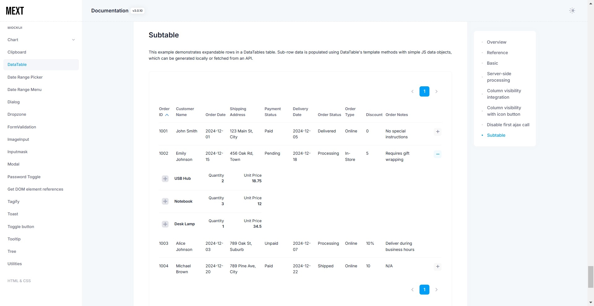
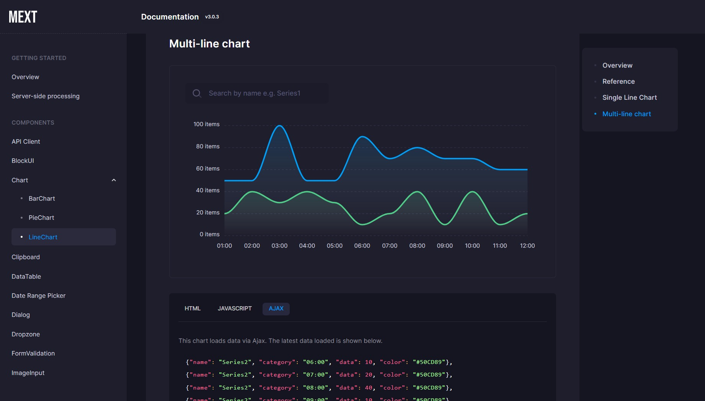
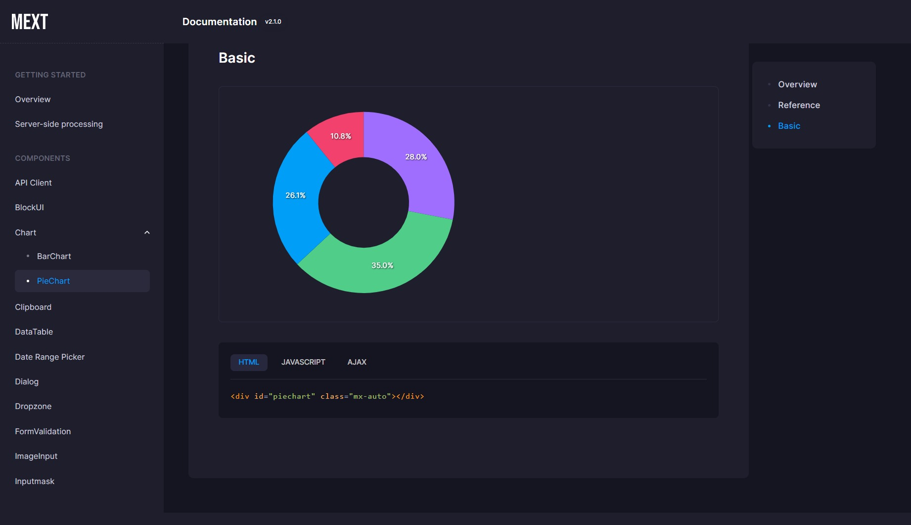
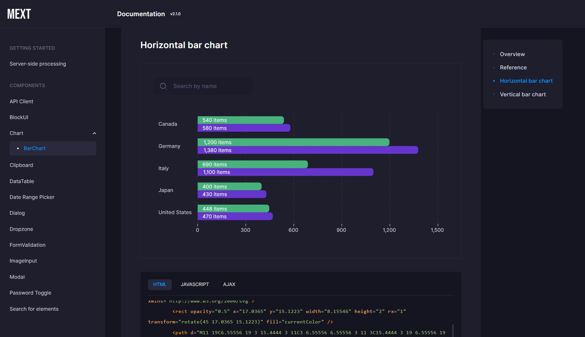

# Changelog
All notable changes to this project will be documented in this file.

## [3.0.16] - 2025/2/9
### Changed
- Added CSS to reduce container padding on tablet and smaller screens, increasing content width on the login page.

## [3.0.15] - 2025/1/31
### Change
- Changes to Tagify Component Styling (see demo [here](https://takuya-motoshima.github.io/metronic-extension/tagify#single-value-select)):
    - Removed unnecessary margin below the input field in single select mode.
    - Increased the opacity of the toggle button in single select mode for better visibility.
    - Made the background of the remove button for selected tags transparent in single select mode.
    - Darkened the color of the tag removal button for better visibility. 

## [3.0.14] - 2025/1/7
### Changed
- Added `setDisabled` method and a reference to the Tagify instance to the Tagify component.
    ```js
    // Disable input.
    tagify.setDisabled(true);

    // Reset the whitelist using the Tagify instance API.
    tagify.api.whitelist = null;
    ```

## [3.0.13] - 2024/12/31
### Fixed
- Fixed a bug where the data table loading indicator was not displayed when the locale option was set to Japanese.

## [3.0.12] - 2024/12/31
### Fixed
- Fixed a bug where the data table loading indicator was not displayed.

## [3.0.11] - 2024/12/27
### Changed
- Added responsive support for subtables. You can check the updated subtable [here](https://takuya-motoshima.github.io/metronic-extension/datatable.html#subtable).
- Added an example to the subtable demo where the expand button is not displayed for rows without subtable data.

## [3.0.10] - 2024/12/27
### Added
- Add Sub Datatable Example [here](https://takuya-motoshima.github.io/metronic-extension/datatable.html#subtable).

  

### Fixed
- Fixed a bug in the demo page where the source maps for some modules were missing.
    Added the following
    - demo/public/build/theme/plugins/global/toastr.js.map
    - demo/public/build/theme/plugins/custom/datatables/pdfmake.min.js.map

### Changed
- Merged docs/v2 and docs/v3 documentation into docs/. Old documents are available at [https://github.com/takuya-motoshima/metronic-extension/releases/tag/v3.0.9](https://github.com/takuya-motoshima/metronic-extension/releases/tag/v3.0.9).

## [3.0.9] - 2024/2/19
### Changed
- Changed the default width of lines in the line chart component (`components.LineChart`) from 3px to 1px.

### Added
- Added Docker build and demo run environments.  
    See the "How to build with Docker" and "How to start the demo with Docker" sections of [README.md](README.md) for details.

### Fixed
- Fixed a bug in the line chart component (`components.LineChart`) where the first tick of the X axis was missing when the option to display the y axis on the right side (`yAxisOpposite`) was enabled.

## [3.0.8] - 2024/2/16
### Changed
- Added an option to the line chart component (`components.LineChart`) for the number of tick intervals to be displayed on the x-axis (`xAxisTickAmount`).  
    The default is the number of data on the x-axis.

    See [here](https://takuya-motoshima.github.io/metronic-extension/linechart.html#reference) for more information.
- Added option (`xaxis.labels.hideOverlappingLabels`) to prevent overlapping X axis labels on line and bar charts (`components.LineChart`, `components.BarChart`).
- The missing source map for the Metronic theme has been added to the dist.  
    If your theme does not have them, copy them into the theme directory and use them.  
    The source map is not necessarily required and the theme will work without it.  
    However, a 404 network error will occur.
    - dist/sourcemaps/plugins/custom/datatables/pdfmake.min.js.map
    - dist/sourcemaps/plugins/global/toastr.js.map

## [3.0.7] - 2024/2/16
### Changed
- Added the following options to the line chart component (`components.LineChart`).
    - gradient: When enabled, the line is filled with a gradient. Default is true.
    - lineWidth: The line width (in pixels). Default is 3.
    - yAxisOpposite: When enabled, will draw the yaxis on the right side of the chart. Default is false.

    See [here](https://takuya-motoshima.github.io/metronic-extension/linechart.html#reference) for more information.

## [3.0.6] - 2024/2/13
### Added
- Added a date range menu component (`components.initDaterangeMenu`).  
  Check [here](https://takuya-motoshima.github.io/metronic-extension/date-range-menu.html) for usage and examples.  

  
  

## [3.0.5] - 2024/2/12
### Changed
- An example has been added for switching the column display of a data table component (`components.ImageInput`) with an icon button.  
    Examples and codes can be found [here](https://takuya-motoshima.github.io/metronic-extension/datatable.html#column-visibility-with-icon-button).  

    

## [3.0.4] - 2024/2/8
### Changed
- Added file input name attribute option to the image input component (`components.ImageInput`).  
    ```js
    import {components} from 'metronic-extension';
    
    new components.ImageInput(document.getElementById('imageInput'), {
      name: 'image'
    });
    ```
- [Theme documentation](https://takuya-motoshima.github.io/metronic-extension/) now offers a choice of three themes.
    - Light  
        
    - Dark  
        
    - System  
        

## [3.0.3] - 2023/12/27
### Added
- Line chart component added.  
    See [here](https://takuya-motoshima.github.io/metronic-extension/linechart.html) how to use it.
  
    

## [3.0.2] - 2023/11/20
### Changed
- The `dataFormatter` (axis label format) option in `BarChart` has been removed.  
    Use the `xAxisFormatter` (X axis label format) and `yAxisFormatter` (Y axis label format) options instead.

## [3.0.1] - 2023/11/20
### Fixed
- Fixed a bug that the parameters specified in the `data` option of `BarChart` and `PieChart` were not sent to the server.

## [3.0.0] - 2023/11/10
### Changed
- Version 3 has a clearer namespace.  
    If you are updating from version 2 to 3, please change the Import statement.

    For example, in the case of the escapeHtml() function, V3 imports as follows.
    ```js
    import {utils} from 'metronic-extension';
    utils.escapeHtml('I think this is good.');// -> I think this is good.
    ```

    In V2, the import was as follows.
    ```js
    import {escapeHtml} from 'metronic-extension';
    escapeHtml('I think this is good.');// -> I think this is good.
    ```

    All changes are as follows.

    <table>
      <thead>
        <tr>
          <th>Version 2 or lower</th>
          <th>Version 3</th>
          <th>Description</th>
        </tr>
      </thead>
      <tbody>
        <tr>
          <td colspan="3">components</td>
        </tr>
        <tr>
          <td>Api</td>
          <td>components.Api</td>
          <td>API client based on <a href="https://axios-http.com/" target="_blank">Axios</a>.</td>
        </tr>
        <tr>
          <td>charts.BarChart</td>
          <td>components.BarChart</td>
          <td>Bar chart based on <a href="https://apexcharts.com/" target="_blank">ApexCharts</a>.</td>
        </tr>
        <tr>
          <td>BlockUI</td>
          <td>components.BlockUI</td>
          <td>BlockUI blocks elements with overlays and loading indicators.</td>
        </tr>
        <tr>
          <td>Datatable</td>
          <td>components.Datatable</td>
          <td>DataTable component based on <a href="https://datatables.net/" target="_blank">datatables.net</a> with advanced instructions.</td>
        </tr>
        <tr>
          <td>Dialog</td>
          <td>components.Dialog</td>
          <td>This is a component created by extending <a href="https://sweetalert2.github.io/" target="_blank">SweetAlert</a> that displays a dialog for the intended use.</td>
        </tr>
        <tr>
          <td>Dropzone</td>
          <td>components.Dropzone</td>
          <td>Dropzone is a component that provides drag-and-drop file upload with image preview.</td>
        </tr>
        <tr>
          <td>ImageInput</td>
          <td>components.ImageInput</td>
          <td>Image Input is a component that allows for simple, lightweight image input fields.</td>
        </tr>
        <tr>
          <td>initClipboard</td>
          <td>components.initClipboard</td>
          <td>
            Initializes a component that copies the text of the element corresponding to the selector specified in the <code>data-clipboard-target</code> attribute to the clipboard.<br>
            The actual process for copying text to the clipboard is handled by <a href="https://clipboardjs.com/" target="_blank">clipboard.js</a>.
          </td>
        </tr>
        <tr>
          <td>initDatepicker</td>
          <td>components.initDatepicker</td>
          <td>Date range picker with <a href="https://www.daterangepicker.com/" target="_blank">daterangepicker plugin</a> as core.</td>
        </tr>
        <tr>
          <td>initPasswordToggle</td>
          <td>components.initPasswordToggle</td>
          <td>Implements a password toggle for the password input element specified by the <code>data-password-toggle</code> attribute.</td>
        </tr>
        <tr>
          <td>initToggleButton</td>
          <td>components.initToggleButton</td>
          <td>Initializes the toggle for button group elements that have the dynamically added <code>[data-kt-buttons="true"]</code> attribute.</td>
        </tr>
        <tr>
          <td>initTooltip</td>
          <td>components.initTooltip</td>
          <td>Initialize tooltips for dynamically added elements using <a href="https://getbootstrap.com/docs/5.2/components/tooltips/" target="_blank">Bootstrap Tooltips</a>.</td>
        </tr>
        <tr>
          <td>Modal</td>
          <td>components.Modal</td>
          <td>Abstract class for a modal that extends <a href="https://getbootstrap.com/docs/5.2/components/modal/" target="_blank">Bootstrap Modal</a>.</td>
        </tr>
        <tr>
          <td>charts.PieChart</td>
          <td>components.PieChart</td>
          <td>Pie chart based on <a href="https://apexcharts.com/" target="_blank">ApexCharts</a>.</td>
        </tr>
        <tr>
          <td>selectRef</td>
          <td>components.selectRef</td>
          <td>
            Searches for HTML elements with the <code>data-ref</code> attribute.<br>
            Returns an object whose key is the <code>data-ref</code> attribute value and whose value is the HTML element.
          </td>
        </tr>
        <tr>
          <td>Tagify</td>
          <td>components.Tagify</td>
          <td>Tag input component based on <a href="https://yaireo.github.io/tagify/" target="_blank">tagify</a>.</td>
        </tr>
        <tr>
          <td>Toast</td>
          <td>components.Toast</td>
          <td>Send push notifications to visitors using toast.</td>
        </tr>
        <tr>
          <td>Tree</td>
          <td>components.Tree</td>
          <td><code>jsTree</code> plugin-based interactive tree component. For more info please visit the plugin's <a class="me-1" href="https://www.jstree.com/" target="_blank">Home</a> or <a href="https://github.com/vakata/jstree" target="_blank">Github Repo</a>.</td>
        </tr>
        <tr>
          <td>Validation</td>
          <td>components.Validation</td>
          <td>A form validation class based on <a href="https://formvalidation.io/" target="_blank">formvalidation.io</a>.</td>
        </tr>
        <tr>
          <td colspan="3">utils</td>
        </tr>
        <tr>
          <td>escapeHtml</td>
          <td>utils.escapeHtml</td>
          <td>Escapes HTML special characters (&amp;&#039;`&quot;&lt;&gt;).</td>
        </tr>
        <tr>
          <td>fetchDataUrl</td>
          <td>utils.fetchDataUrl</td>
          <td>Get the fetched result as a Data URL.</td>
        </tr>
        <tr>
          <td>fetchImage</td>
          <td>utils.fetchImage</td>
          <td>Get the fetched result as an Image object.</td>
        </tr>
        <tr>
          <td>formatBytes</td>
          <td>utils.formatBytes</td>
          <td>Convert bytes to strings with units (KB, MB, GB, etc.).</td>
        </tr>
        <tr>
          <td>getExtensionFromDataUrl</td>
          <td>utils.getExtensionFromDataUrl</td>
          <td>Get extension from Data URL.</td>
        </tr>
        <tr>
          <td>getType</td>
          <td>utils.getType</td>
          <td>Get type name.</td>
        </tr>
        <tr>
          <td>isAsyncFunction</td>
          <td>utils.isAsyncFunction</td>
          <td>Check if it is an asynchronous function.</td>
        </tr>
        <tr>
          <td>isEmpty</td>
          <td>utils.isEmpty</td>
          <td>Check if the value is empty.</td>
        </tr>
        <tr>
          <td>isFunction</td>
          <td>utils.isFunction</td>
          <td>Check if it is a function.</td>
        </tr>
        <tr>
          <td>isPlainObject</td>
          <td>utils.isPlainObject</td>
          <td>Check if it is a plain object created by &quot;{}&quot; or &quot;new Object()&quot;.</td>
        </tr>
        <tr>
          <td>isString</td>
          <td>utils.isString</td>
          <td>Check if it is a string.</td>
        </tr>
        <tr>
          <td>isSymbol</td>
          <td>utils.isSymbol</td>
          <td>Checks if the type is Symbol.</td>
        </tr>
        <tr>
          <td>numberFormat</td>
          <td>utils.numberFormat</td>
          <td>Number Format (Comma Separation) as per locale.</td>
        </tr>
        <tr>
          <td>trim</td>
          <td>utils.trim</td>
          <td>Trim blanks before and after.</td>
        </tr>
        <tr>
          <td>urlToMime</td>
          <td>utils.urlToMime</td>
          <td>Get the MIME type inferred from the extension at the end of the URL.</td>
        </tr>
      </tbody>
    </table>

## [2.1.2] - 2023/11/7
### Changed
- Added getter method for ApexCharts instances to BarChart and PieChart. See [here](https://apexcharts.com/docs/methods/#) for instructions on how to use the instance.

## [2.1.1] - 2023/11/6
### Added
- Added Pie Chart component. Click [here](https://takuya-motoshima.github.io/metronic-extension/piechart.html) to learn how to use it.

    

## [2.1.0] - 2023/10/30
### Added
- An extended bar chart component based on [Apexcharts](https://apexcharts.com/) has been added.  
    To learn how to use the added components, please click [here](https://takuya-motoshima.github.io/metronic-extension/barchart.html).

    

### Changed
- Fix API client class (`Api`).
    - Changed `requestErrorHook` method name to `errorHook`.
    - The `onResponseError` method has been removed. Please use the `errorHook` method instead.
    - The `onAfterResponse` method has been removed. Use the `afterResponseHook` method instead.
    - The `onBeforeRequest` method has been removed. Use the `beforeRequestHook` method instead.
- Fix data table component.
    - Changed `requestErrorHook` method name to `ajaxErrorHook`.
- Changed the name of the attribute set on the element that initializes the password toggle from `data-show-password-toggle` to `data-password-toggle`.
- Fix Modal Abstract class.
    - Changed `showBlockUI` method name to `showLoading`.
    - Changed `hideBlockUI` method name to `hideLoading`.
    - Changed `enableHideWithEscapeKey` method name to `enableEscapeKey`.
    - Changed `disableHideWithEscapeKey` method name to `disableEscapeKey`.
- Fix tree component (`Tree`).
    - Changed parent node ID replacement character in folder creation request URL from `_PARENT_FOLDER_ID_` to `_PARENT_NODE_ID_`.
    - Changed parent node ID replacement character in file creation request URL from `_PARENT_FOLDER_ID_` to `_PARENT_NODE_ID_`.
    - Changed the current node ID replacement character in folder delete request URL from `_CURRENT_FOLDER_ID_` to `_CURRENT_NODE_ID_`.
    - Changed current node ID replacement character in folder rename request URL from `_CURRENT_FOLDER_ID_` to `_CURRENT_NODE_ID_`.
    - Changed current node ID replacement character in file delete request URL from `_CURRENT_FILE_ID_` to `_CURRENT_NODE_ID_`.
    - Changed the current node ID replacement character in file rename request URL from `_CURRENT_FILE_ID_` to `_CURRENT_NODE_ID_`.
- The utility's `isDataUrl()` function has been changed to `validators/isDataURI()`.

## [2.0.31] - 2023/9/15
### Changed
- Changed the validate function name for file (directory) paths from `isDirectory` to `isPath`. Also, a bug in regular expressions that prevented path names with subdirectories from being validated correctly has been fixed.

## [2.0.30] - 2023/9/14
### Changed
- In DataTable, add process to initialize drop-down menu buttons on tables.

## [2.0.29] - 2023/9/6
### Fixed
- Fixed a bug in the toggle button initialization function that did not activate the target element when clicked.

## [2.0.28] - 2023/9/6
### Added
- Added initialization function for the toggle button component.

### Changed
- Fixed some interface names for options, etc.

## [2.0.27] - 2023/8/30
### Changed
- Fix to allow acquisition of all row data in the datatable row data acquisition method.

## [2.0.26] - 2023/8/29
### Changed
- Update TypeScript version from 4.5.2 to 5.1.6.
- Delete unused dependent packages.
- Change `initShowPasswordToggle()` function name to the simple name `initPasswordToggle()`.
- Changed the custom validation name for the form validation component (`Validation`).
    <table>
      <thead>
        <tr>
          <th>Before</th>
          <th>After</th>
          <th>Description</th>
        </tr>
      </thead>
      <tbody>
        <tr>
          <td>isIntegersBetween()</td>
          <td>isNumericRange()</td>
          <td>Check the range of numbers.</td>
        </tr>
        <tr>
          <td>isCidr(), isIp()</td>
          <td>isIP()</td>
          <td>Check for IP (version 4 or 6).</td>
        </tr>
        <tr>
          <td>isHost()</td>
          <td>isFQDN()</td>
          <td>Check if the domain name is fully qualified (e.g. domain.com).</td>
        </tr>
        <tr>
          <td>isHostOrIp()</td>
          <td>isFQDNorIP()</td>
          <td>Check for a fully qualified domain name (e.g. domain.com) or IP (version 4 or 6).</td>
        </tr>
      </tbody>
    </table>

### Added
- Added a validator function that can be used independently. Click [here](https://takuya-motoshima.github.io/metronic-extension/utilities.html#validatorFunctions) for details.

## [2.0.25] - 2023/8/15
### Changed
- Fixed clipboard copy component to support metronic version 8.1.8.

## [2.0.24] - 2023/8/8
### Changed
- Play notification sound when success dialog (`Dialog.success()`) is invoked.

## [2.0.23] - 2023/8/8
### Changed
- Added a reset form method (`resetForm`) to the form validation component (`Validation`).

## [2.0.22] - 2023/8/2
### Changed
- Changed the method name of the ImageInput component.
    <table>
      <thead>
        <tr>
          <th>Before</th>
          <th>After</th>
          <th>Description</th>
        </tr>
      </thead>
      <tbody>
        <tr>
          <td>getImgDataUrl()</td>
          <td>getImage()</td>
          <td>Get the data URL of the current image.</td>
        </tr>
        <tr>
          <td>onchange()</td>
          <td>onChange()</td>
          <td>Set callback function for image changes.</td>
        </tr>
      </tbody>
    </table>

### Fixed
- Fixed a bug in the ImageInput component that when an image is deleted, the value of the hidden element is not empty.

## [2.0.21] - 2023/7/28
### Changed
- The ImageInput component now allows you to select files by clicking on the preview area.

## [2.0.20] - 2023/7/28
### Changed
- Added option (`options.firstAjax`) to not load data first when retrieving Datatable data asynchronously. If `true`, load immediately; if `false`, do not load until the reload method is called. Default is `true`.
- Added locale option for display text in DataTable (`options.locale`). English (`en`) or Japanese (`ja`) can be specified. The default is English (`en`).

## [2.0.19] - 2023/7/27
### Changed
- Add color-scheme CSS to the theme.
- Faster loading times when data URLs are set for the current and default images in the ImageInput component.

## [2.0.18] - 2023/7/23
### Added
- Added a method for acquiring file input elements to the ImageInput component.

## [2.0.17] - 2023/7/13
### Changed
- Increased size of password toggle icons.

## [2.0.16] - 2023/6/30
### Fixed
- Fixed a bug in the Date range picker initialization function where the locale option was not applied.

## [2.0.15] - 2023/6/29
### Changed
- Added the following options to the date range picker initialization method
  - maxDays: Maximum number of days that can be selected. Default is indefinite (`undefined`).

## [2.0.14] - 2023/6/28
### Changed
- Added the following options to the date range picker initialization method.
  - autoUpdateInput: Indicates whether the date range picker should automatically update the value of the `input` element it&#039;s attached to at initialization and when the selected dates change. Default is `true`.
  - format: Date Format. Default is `YYYY/M/D`.

## [2.0.13] - 2023/6/2
### Changed
- Added auto-scroll option for invalid elements to form validation. The default value of the option is `true`.

## [2.0.12] - 2023/6/1
### Changed
- Added tree refresh and node refresh methods to the tree class.

## [2.0.11] - 2023/5/30
### Changed
- Added a method for renaming nodes to the tree class.

## [2.0.10] - 2023/5/29
### Fixed
- Fixed a bug in the tree class where the node ID received by the file node selection event handler immediately after creation was incorrect.

## [2.0.9] - 2023/5/29
### Changed
- Tree class folder and file creation API now returns an error if the response data does not have the ID of the created node.
- Added file creation hook function to the tree class. Hooks can be used to incorporate your own file creation logic.  

## [2.0.8] - 2023/5/26
### Changed
- Added `ready` event to Tree class. This event is triggered when all nodes have been loaded and the previously selected node's selection state has been restored.

## [2.0.7] - 2023/5/25
### Changed
- Added functionality to the tree class.

## [2.0.6] - 2023/5/25
### Changed
- Added node type options to the folder tree.

## [2.0.5] - 2023/3/26
### Changed
- Changed the return value of the reload method of Datatable from `void` to `Promise<any>`. You can use await to wait until after the data has been reloaded and the table has been completely redrawn. 

## [2.0.4] - 2023/3/26
### Changed
- Fixed a typo in the change log.

### Added
- Added a method to clear all rows to the Datatable class.
- Add getter for DataTable API object to Datatable class.

## [2.0.3] - 2023/3/15
### Added
- Added option to show Cancel button in Success dialog. Default is `false`. Also, the return value of the success dialog has been fixed to return true if the OK button is clicked and false if the Cancel button is clicked.  

## [2.0.2] - 2023/3/7
### Added
- Added an option to the constructor of the form validation class to stop execution of the remaining validators if a field has validators that do not pass. Default is enabled.
    
## [2.0.1] - 2023/3/6
### Changed
- Added `axios.create` option to the Rest client class constructor as a parameter.  

## [2.0.0] - 2023/2/27
### Changed
- Updated Metronic version from 8.1.2 to 8.1.7.  
    - With the version upgrade, the theme attribute name for demo and docs has been changed from `data-theme` to `data-bs-theme`.  
    - The CSS variable prefix has been changed from `--kt-` to `--bs-` with the version upgrade.

## [1.0.23] - 2023/2/16
### Changed
- Fix documentation.

### Added
- Added tree component.
- Added a function to check if a variable is a function type.

## [1.0.22] - 2023/1/30
### Changed
- Changed the default value of the reset page of the reload method of the DataTable component from `true` to `false`.

## [1.0.21] - 2023/1/30
### Changed
- Added a page reset parameter to the reload method of the Datatable component. The default value for page reset is `true`.

## [1.0.20] - 2023/1/24
### Added
- Add column reference methods to DataTable class.

## [1.0.19] - 2023/1/23
### Added
- Added example of DataTable switching column visibility.

## [1.0.18] - 2023/1/10
### Changed
- The bootstrap tooltip setup function (initTooltip) now returns a tooltip object.

## [1.0.17] - 2023/1/8
### Changed
- Fixed an error that occurred in the process of extending the ajax option of a DataTable when the ajax option is a URL string.

## [1.0.16] - 2023/1/8
### Fixed
- Fixed a bug that prevented importing as an ESM module.

## [1.0.15] - 2022/11/24
### Changed
- Added an event handler to the Dropzone component that fires when a selected file is canceled.

## [1.0.14] - 2022/11/21
### Changed
- Added a method to the modal class to determine if the modal is currently visible.

## [1.0.13] - 2022/11/18
### Changed
- The default image for `ImageInput` can now be set using the `data-image-input-default` attribute.
- The current image in `ImageInput` can now be set using the `data-image-input-current` attribute.

## [1.0.12] - 2022/11/18
### Changed
- Added support for build scripts on Windows OS.

### Fixed
- Fixed a bug that the DataURL of the current image specified in the ImageInput component was not set to the hidden element.

## [1.0.11] - 2022/11/17
### Added
- Add a component to toggle password visibility. The component is applied to input elements with the `data-show-password-toggle="true"` attribute.  

## [1.0.10] - 2022/11/15
### Added
- Added a tag change event (fired when a tag is added or removed) to the Tagify component.

## [1.0.9] - 2022/11/14
### Added
- Added Dropzone component.

## [1.0.8] - 2022/11/14
### Changed
- Add docs/ to .npmignore.

## [1.0.7] - 2022/11/14
### Fixed
- Remove node_modules in docs that were accidentally included in the package.

## [1.0.6] - 2022/11/14
### Added
- Add Tagify component.

## [1.0.5] - 2022/10/24
###  Added
- Added Japanese phone number custom form validation to form validation.  

## [1.0.4] - 2022/10/24
### Added
- Added event handler that fire when each field is valid or invalid.
- Add a method to immediately validate the specified field.

## [1.0.3] - 2022/10/24
### Added
- Added Japanese phone number custom form validation to form validation.  

## [1.0.2] - 2022/10/24
### Added
- Add request error hook method to API class.
- Added request error hook method to Datatable class.

### Fixed
- Fix to prevent tooltip elements from being double instantiated. 

## [1.0.1] - 2022/10/20
### Fixed
- Removed boostrap from this package which conflicts with metronic's bootstrap.

## [1.0.0] - 2022/10/17
### Added
- Released.

[1.0.1]: https://github.com/takuya-motoshima/metronic-extension/compare/v1.0.0...v1.0.1
[1.0.2]: https://github.com/takuya-motoshima/metronic-extension/compare/v1.0.1...v1.0.2
[1.0.3]: https://github.com/takuya-motoshima/metronic-extension/compare/v1.0.2...v1.0.3
[1.0.4]: https://github.com/takuya-motoshima/metronic-extension/compare/v1.0.3...v1.0.4
[1.0.5]: https://github.com/takuya-motoshima/metronic-extension/compare/v1.0.4...v1.0.5
[1.0.6]: https://github.com/takuya-motoshima/metronic-extension/compare/v1.0.5...v1.0.6
[1.0.7]: https://github.com/takuya-motoshima/metronic-extension/compare/v1.0.6...v1.0.7
[1.0.8]: https://github.com/takuya-motoshima/metronic-extension/compare/v1.0.7...v1.0.8
[1.0.9]: https://github.com/takuya-motoshima/metronic-extension/compare/v1.0.8...v1.0.9
[1.0.10]: https://github.com/takuya-motoshima/metronic-extension/compare/v1.0.9...v1.0.10
[1.0.11]: https://github.com/takuya-motoshima/metronic-extension/compare/v1.0.10...v1.0.11
[1.0.12]: https://github.com/takuya-motoshima/metronic-extension/compare/v1.0.11...v1.0.12
[1.0.13]: https://github.com/takuya-motoshima/metronic-extension/compare/v1.0.12...v1.0.13
[1.0.14]: https://github.com/takuya-motoshima/metronic-extension/compare/v1.0.13...v1.0.14
[1.0.15]: https://github.com/takuya-motoshima/metronic-extension/compare/v1.0.14...v1.0.15
[1.0.16]: https://github.com/takuya-motoshima/metronic-extension/compare/v1.0.15...v1.0.16
[1.0.17]: https://github.com/takuya-motoshima/metronic-extension/compare/v1.0.16...v1.0.17
[1.0.18]: https://github.com/takuya-motoshima/metronic-extension/compare/v1.0.17...v1.0.18
[1.0.19]: https://github.com/takuya-motoshima/metronic-extension/compare/v1.0.18...v1.0.19
[1.0.20]: https://github.com/takuya-motoshima/metronic-extension/compare/v1.0.19...v1.0.20
[1.0.21]: https://github.com/takuya-motoshima/metronic-extension/compare/v1.0.20...v1.0.21
[1.0.22]: https://github.com/takuya-motoshima/metronic-extension/compare/v1.0.21...v1.0.22
[1.0.23]: https://github.com/takuya-motoshima/metronic-extension/compare/v1.0.22...v1.0.23
[2.0.0]: https://github.com/takuya-motoshima/metronic-extension/compare/v1.0.23...v2.0.0
[2.0.1]: https://github.com/takuya-motoshima/metronic-extension/compare/v2.0.0...v2.0.1
[2.0.2]: https://github.com/takuya-motoshima/metronic-extension/compare/v2.0.1...v2.0.2
[2.0.3]: https://github.com/takuya-motoshima/metronic-extension/compare/v2.0.2...v2.0.3
[2.0.4]: https://github.com/takuya-motoshima/metronic-extension/compare/v2.0.3...v2.0.4
[2.0.5]: https://github.com/takuya-motoshima/metronic-extension/compare/v2.0.4...v2.0.5
[2.0.6]: https://github.com/takuya-motoshima/metronic-extension/compare/v2.0.5...v2.0.6
[2.0.7]: https://github.com/takuya-motoshima/metronic-extension/compare/v2.0.6...v2.0.7
[2.0.8]: https://github.com/takuya-motoshima/metronic-extension/compare/v2.0.7...v2.0.8
[2.0.9]: https://github.com/takuya-motoshima/metronic-extension/compare/v2.0.8...v2.0.9
[2.0.10]: https://github.com/takuya-motoshima/metronic-extension/compare/v2.0.9...v2.0.10
[2.0.11]: https://github.com/takuya-motoshima/metronic-extension/compare/v2.0.10...v2.0.11
[2.0.12]: https://github.com/takuya-motoshima/metronic-extension/compare/v2.0.11...v2.0.12
[2.0.13]: https://github.com/takuya-motoshima/metronic-extension/compare/v2.0.12...v2.0.13
[2.0.14]: https://github.com/takuya-motoshima/metronic-extension/compare/v2.0.13...v2.0.14
[2.0.15]: https://github.com/takuya-motoshima/metronic-extension/compare/v2.0.14...v2.0.15
[2.0.16]: https://github.com/takuya-motoshima/metronic-extension/compare/v2.0.15...v2.0.16
[2.0.17]: https://github.com/takuya-motoshima/metronic-extension/compare/v2.0.16...v2.0.17
[2.0.18]: https://github.com/takuya-motoshima/metronic-extension/compare/v2.0.17...v2.0.18
[2.0.19]: https://github.com/takuya-motoshima/metronic-extension/compare/v2.0.18...v2.0.19
[2.0.20]: https://github.com/takuya-motoshima/metronic-extension/compare/v2.0.19...v2.0.20
[2.0.21]: https://github.com/takuya-motoshima/metronic-extension/compare/v2.0.20...v2.0.21
[2.0.22]: https://github.com/takuya-motoshima/metronic-extension/compare/v2.0.21...v2.0.22
[2.0.23]: https://github.com/takuya-motoshima/metronic-extension/compare/v2.0.22...v2.0.23
[2.0.24]: https://github.com/takuya-motoshima/metronic-extension/compare/v2.0.23...v2.0.24
[2.0.25]: https://github.com/takuya-motoshima/metronic-extension/compare/v2.0.24...v2.0.25
[2.0.26]: https://github.com/takuya-motoshima/metronic-extension/compare/v2.0.25...v2.0.26
[2.0.27]: https://github.com/takuya-motoshima/metronic-extension/compare/v2.0.26...v2.0.27
[2.0.28]: https://github.com/takuya-motoshima/metronic-extension/compare/v2.0.27...v2.0.28
[2.0.29]: https://github.com/takuya-motoshima/metronic-extension/compare/v2.0.28...v2.0.29
[2.0.30]: https://github.com/takuya-motoshima/metronic-extension/compare/v2.0.29...v2.0.30
[2.0.31]: https://github.com/takuya-motoshima/metronic-extension/compare/v2.0.30...v2.0.31
[2.1.0]: https://github.com/takuya-motoshima/metronic-extension/compare/v2.0.31...v2.1.0
[2.1.1]: https://github.com/takuya-motoshima/metronic-extension/compare/v2.1.0...v2.1.1
[2.1.2]: https://github.com/takuya-motoshima/metronic-extension/compare/v2.1.1...v2.1.2
[3.0.0]: https://github.com/takuya-motoshima/metronic-extension/compare/v2.1.2...v3.0.0
[3.0.1]: https://github.com/takuya-motoshima/metronic-extension/compare/v3.0.0...v3.0.1
[3.0.2]: https://github.com/takuya-motoshima/metronic-extension/compare/v3.0.1...v3.0.2
[3.0.3]: https://github.com/takuya-motoshima/metronic-extension/compare/v3.0.2...v3.0.3
[3.0.4]: https://github.com/takuya-motoshima/metronic-extension/compare/v3.0.3...v3.0.4
[3.0.5]: https://github.com/takuya-motoshima/metronic-extension/compare/v3.0.4...v3.0.5
[3.0.6]: https://github.com/takuya-motoshima/metronic-extension/compare/v3.0.5...v3.0.6
[3.0.7]: https://github.com/takuya-motoshima/metronic-extension/compare/v3.0.6...v3.0.7
[3.0.8]: https://github.com/takuya-motoshima/metronic-extension/compare/v3.0.7...v3.0.8
[3.0.9]: https://github.com/takuya-motoshima/metronic-extension/compare/v3.0.8...v3.0.9
[3.0.10]: https://github.com/takuya-motoshima/metronic-extension/compare/v3.0.9...v3.0.10
[3.0.11]: https://github.com/takuya-motoshima/metronic-extension/compare/v3.0.10...v3.0.11
[3.0.12]: https://github.com/takuya-motoshima/metronic-extension/compare/v3.0.11...v3.0.12
[3.0.13]: https://github.com/takuya-motoshima/metronic-extension/compare/v3.0.12...v3.0.13
[3.0.14]: https://github.com/takuya-motoshima/metronic-extension/compare/v3.0.13...v3.0.14
[3.0.15]: https://github.com/takuya-motoshima/metronic-extension/compare/v3.0.14...v3.0.15
[3.0.16]: https://github.com/takuya-motoshima/metronic-extension/compare/v3.0.14...v3.0.16