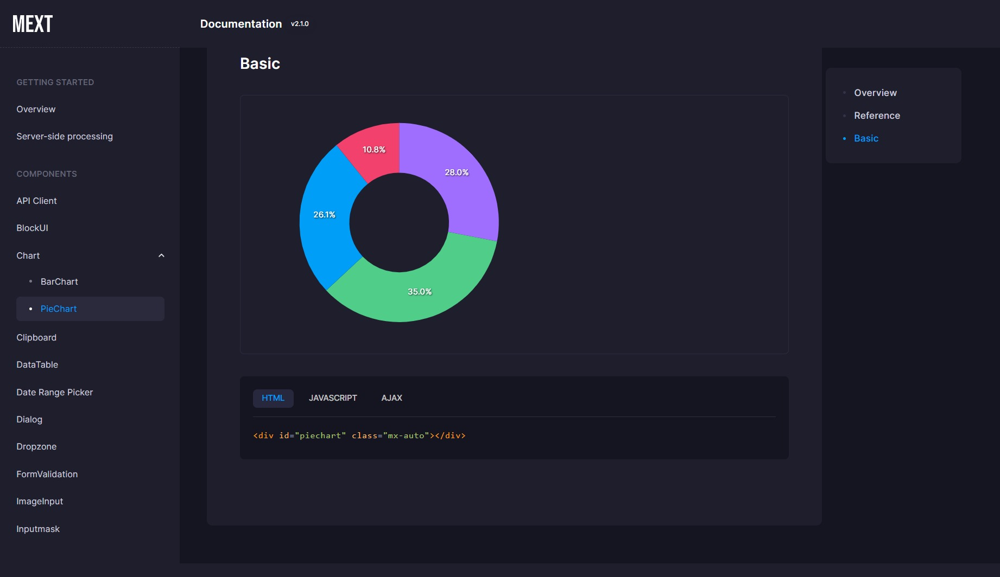
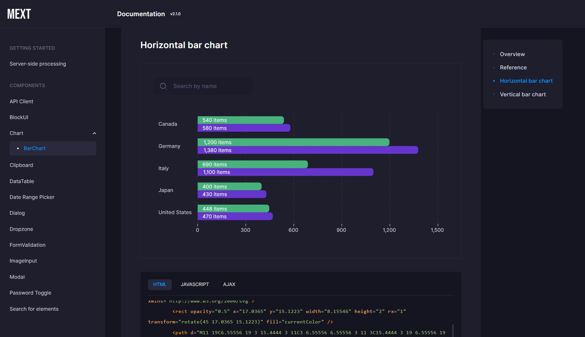

# metronic-extension
Extension package for the Metronic WEB theme.

## Documentation
Metronic Extension V3 documentation can be found [here](https://takuya-motoshima.github.io/metronic-extension/v3/).

If you are using Metronic Extension V2, please see the documentation [here](https://takuya-motoshima.github.io/metronic-extension/v2/).

## Installation
```sh
npm install --save metronic-extension
```

## Release Notes
All changes can be found [here](CHANGELOG.md).

- [3.0.0] - 2023/11/10
    - Version 3 has a clearer namespace.  
        If you are updating from version 2 to 3, please change the Import statement.  

        See the [change history](CHANGELOG.md) for details.
- [2.1.2] - 2023/11/7
    - Added getter method for ApexCharts instances to BarChart and PieChart.
        See [here](https://apexcharts.com/docs/methods/#) for instructions on how to use the instance.

        ```js
        import {components} from 'metronic-extension';// Version 3 or higher.
        // import {charts} from 'metronic-extension';// Version 2 or lower.

        // Initialize chart.
        const piechart = new components.PieChart(document.getElementById('piechart'), {// Version 3 or higher.
        // const piechart = new charts.PieChart(document.getElementById('piechart'), {// Version 2 or lower.
          ajax: {
            url: 'json/pie-chart.json'
          },
        });

        // Chart Instance.
        piechart.instance;
        ```
- [2.1.1] - 2023/11/6
    - Added Pie Chart component. Click [here](https://takuya-motoshima.github.io/metronic-extension/v3/piechart.html) to learn how to use it.

        
- [2.1.0] - 2023/10/30
    - An extended bar chart component based on [Apexcharts](https://apexcharts.com/) has been added.  
        To learn how to use the added components, please click [here](https://takuya-motoshima.github.io/metronic-extension/v3/barchart.html).

        

## Testing
With [npm](http://npmjs.org) do:

```sh
npm test
```

## Author
**Takuya Motoshima**

* [github/takuya-motoshima](https://github.com/takuya-motoshima)
* [twitter/TakuyaMotoshima](https://twitter.com/TakuyaMotoshima)
* [facebook/takuya.motoshima.7](https://www.facebook.com/takuya.motoshima.7)

## License
[MIT](LICENSE)