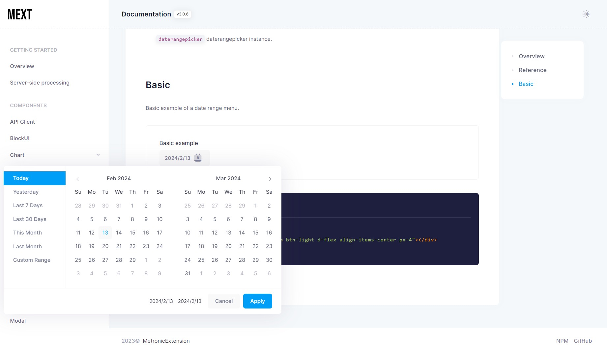
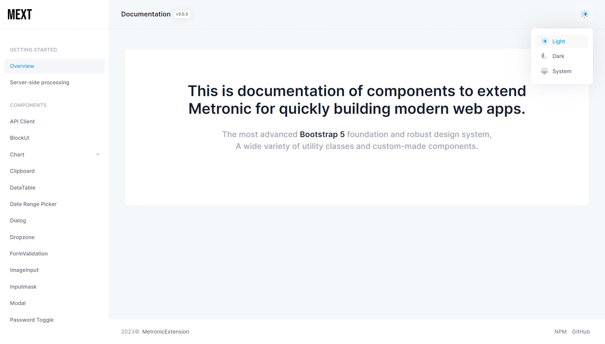
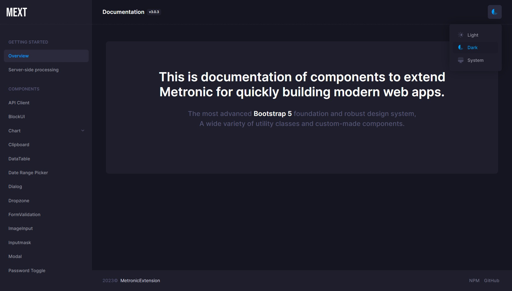
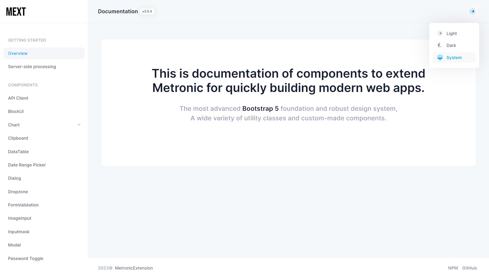
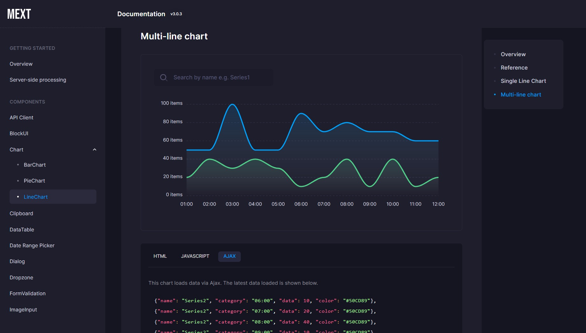

# metronic-extension
Extension package for the Metronic WEB theme.

## Documentation
Metronic Extension V3 documentation can be found [here](https://takuya-motoshima.github.io/metronic-extension/v3/).

If you are using Metronic Extension V2, please see the documentation [here](https://takuya-motoshima.github.io/metronic-extension/v2/).

## Installation
```sh
npm install --save metronic-extension
```

## Release Notes
All changes can be found [here](CHANGELOG.md).

- [3.0.7] - 2024/2/16
    - Added the following options to the line chart component (`components.LineChart`).
        - gradient: When enabled, the line is filled with a gradient. Default is true.
        - lineWidth: The line width (in pixels). Default is 3.
        - yAxisOpposite: When enabled, will draw the yaxis on the right side of the chart. Default is false.

        See [here](https://takuya-motoshima.github.io/metronic-extension/v3/linechart.html#reference) for more information.
- [3.0.6] - 2024/2/13
    - Added a date range menu component (`components.initDaterangeMenu`).  
        Check [here](https://takuya-motoshima.github.io/metronic-extension/v3/date-range-menu.html) for usage and examples.  

        
        
- [3.0.5] - 2024/2/12
    - An example has been added for switching the column display of a data table component (`components.ImageInput`) with an icon button.  
        Examples and codes can be found [here](https://takuya-motoshima.github.io/metronic-extension/v3/datatable.html#column-visibility-with-icon-button).  

        
- [3.0.4] - 2024/2/8
    - Added file input name attribute option to the image input component (`components.ImageInput`).  
        ```js
        import {components} from 'metronic-extension';
        
        new components.ImageInput(document.getElementById('imageInput'), {
        name: 'image'
        });
        ```
    - [Theme documentation](https://takuya-motoshima.github.io/metronic-extension/v3/) now offers a choice of three themes.
        - Light  
            
        - Dark  
            
        - System  
            
- [3.0.3] - 2023/12/27
    - Line chart component added.  
        See [here](https://takuya-motoshima.github.io/metronic-extension/v3/linechart.html) how to use it.
    
        

## Testing
With [npm](http://npmjs.org) do:

```sh
npm test
```

## Author
**Takuya Motoshima**

* [github/takuya-motoshima](https://github.com/takuya-motoshima)
* [twitter/TakuyaMotoshima](https://twitter.com/TakuyaMotoshima)
* [facebook/takuya.motoshima.7](https://www.facebook.com/takuya.motoshima.7)

## License
[MIT](LICENSE)