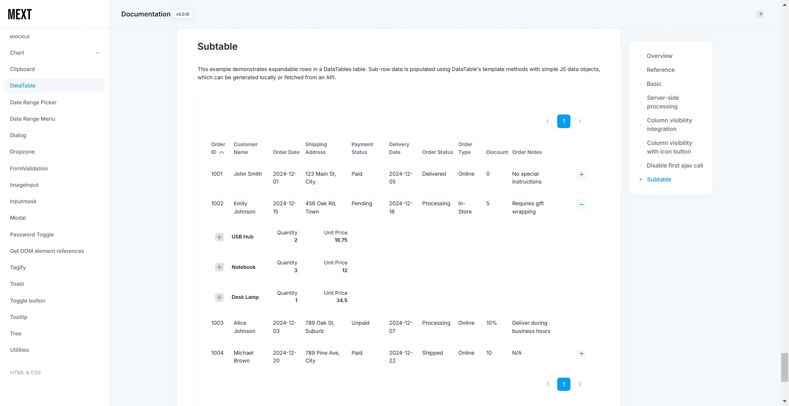

# metronic-extension
Extension package for the Metronic WEB theme.

- [metronic-extension](#metronic-extension)
  - [Documentation](#documentation)
  - [Installation](#installation)
  - [How to start the demo with Docker](#how-to-start-the-demo-with-docker)
  - [Release Notes](#release-notes)
  - [Testing](#testing)
  - [Author](#author)
  - [License](#license)

## Documentation
Metronic Extension documentation can be found [here](https://takuya-motoshima.github.io/metronic-extension/).

## Installation
```sh
npm i metronic-extension
```

## How to start the demo with Docker
See [here](demo/README.md).

## Release Notes
All changes can be found [here](CHANGELOG.md).

- [3.0.11] - 2024/12/27
    - Added responsive support for subtables. You can check the updated subtable [here](https://takuya-motoshima.github.io/metronic-extension/datatable.html#subtable).
    - Added an example to the subtable demo where the expand button is not displayed for rows without subtable data.
- [3.0.10] - 2024/12/27
    - Add Sub Datatable Example [here](https://takuya-motoshima.github.io/metronic-extension/datatable.html#subtable).

        
    - Fixed a bug in the demo page where the source maps for some modules were missing.
        Added the following
        - demo/public/build/theme/plugins/global/toastr.js.map
        - demo/public/build/theme/plugins/custom/datatables/pdfmake.min.js.map
    - Merged docs/v2 and docs/v3 documentation into docs/. Old documents are available at [https://github.com/takuya-motoshima/metronic-extension/releases/tag/v3.0.9](https://github.com/takuya-motoshima/metronic-extension/releases/tag/v3.0.9).
- [3.0.9] - The release of the package has not yet been determined.
    - Changed the default width of lines in the line chart component (`components.LineChart`) from 3px to 1px.
    - Added Docker build and demo run environments.  
        See the "How to build with Docker" and "How to start the demo with Docker" sections of [README.md](README.md) for details.
    - Fixed a bug in the line chart component (`components.LineChart`) where the first tick of the X axis was missing when the option to display the y axis on the right side (`yAxisOpposite`) was enabled.
- [3.0.8] - 2024/2/16
    - Added an option to the line chart component (`components.LineChart`) for the number of tick intervals to be displayed on the x-axis (`xAxisTickAmount`).  
        The default is the number of data on the x-axis.

        See [here](https://takuya-motoshima.github.io/metronic-extension/linechart.html#reference) for more information.
    - Added option (`xaxis.labels.hideOverlappingLabels`) to prevent overlapping X axis labels on line and bar charts (`components.LineChart`, `components.BarChart`).
    - The missing source map for the Metronic theme has been added to the dist.  
        If your theme does not have them, copy them into the theme directory and use them.  
        The source map is not necessarily required and the theme will work without it.  
        However, a 404 network error will occur.
        - dist/sourcemaps/plugins/custom/datatables/pdfmake.min.js.map
        - dist/sourcemaps/plugins/global/toastr.js.map
- [3.0.7] - 2024/2/16
    - Added the following options to the line chart component (`components.LineChart`).
        - gradient: When enabled, the line is filled with a gradient. Default is true.
        - lineWidth: The line width (in pixels). Default is 3.
        - yAxisOpposite: When enabled, will draw the yaxis on the right side of the chart. Default is false.

        See [here](https://takuya-motoshima.github.io/metronic-extension/linechart.html#reference) for more information.
- [3.0.6] - 2024/2/13
    - Added a date range menu component (`components.initDaterangeMenu`).  
        Check [here](https://takuya-motoshima.github.io/metronic-extension/date-range-menu.html) for usage and examples.  

        
        
- [3.0.5] - 2024/2/12
    - An example has been added for switching the column display of a data table component (`components.ImageInput`) with an icon button.  
        Examples and codes can be found [here](https://takuya-motoshima.github.io/metronic-extension/datatable.html#column-visibility-with-icon-button).  

        

## Testing
With [npm](http://npmjs.org) do:

```sh
npm test
```

## Author
**Takuya Motoshima**

* [github/takuya-motoshima](https://github.com/takuya-motoshima)
* [twitter/TakuyaMotoshima](https://twitter.com/TakuyaMotoshima)
* [facebook/takuya.motoshima.7](https://www.facebook.com/takuya.motoshima.7)

## License
[MIT](LICENSE)