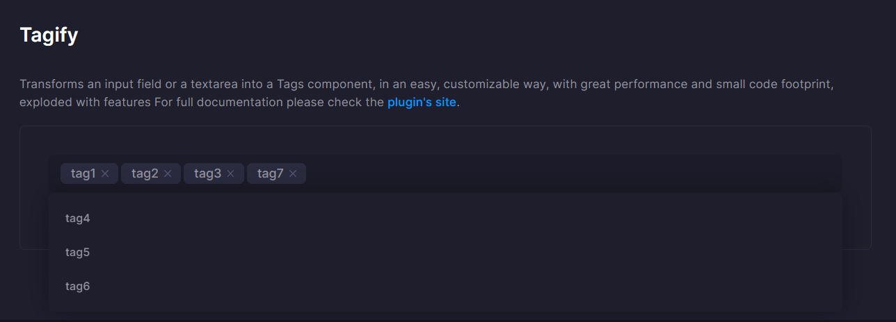

# Changelog
All notable changes to this project will be documented in this file.

## [1.0.7] - 2022/11/14
### Fixed
- Remove node_modules in docs that were accidentally included in the package.

## [1.0.6] - 2022/11/14
### Added
- Add Tagify (src/components/Tagify) component.
    

## [1.0.5] - 2022/10/24
###  Added
- Added Japanese phone number custom validation to form validation.  
    HTML:
    ```html
    <!--begin::Form-->
    <form data-ref="customValidationForm" autocomplete="off">
      <!--begin::Input group-->
      <div class="fv-row mb-10">
        <!--begin::Label-->
        <label class="fw-semibold fs-6 mb-2">Integer from 1 to 99</label>
        <!--end::Label-->
        <!--begin::Input-->
        <input name="betweenValues" class="form-control" placeholder="99" value="99">
        <!--end::Input-->
      </div>
      <!--end::Input group-->
      <!--begin::Actions-->
      <button type="submit" class="btn btn-primary">Validation Form</button>
      <!--end::Actions-->
    </form>
    <!--end::Form-->
    ```

    JS:
    ```js
    import {selectRef, Validation} from 'metronic-extension';

    const ref = selectRef();
    const validation = new Validation(ref.customValidationForm, {
      betweenValues: {
        validators: {
          isIntegersBetween: {
            message: 'This is not correct.',
            min: 1,
            max: 99
          }
        }
      }
    });
    validation.onValid(() => {
      alert('Form has been successfully submitted!');
    });
    ```

## [1.0.4] - 2022/10/24
### Added
- Added event handler that fire when each field is valid or invalid.
    ```js
    import {Validation} from 'metronic-extension';

    const validation = new Validation(document.getElementById('demoForm'), {
      userName: {
        validators: {
          notEmpty: {message: 'Enter here.'}
        }
      }
    });
    validation
      .onValid(async () => {
        // All fields are valid.
      })
      .onFieldValid(name => {
        console.log(`${name} field is valid`);
        // =>userName field is valid
      })
      .onFieldInvalid(name => {
        console.log(`${name} field is invalid`);
        // =>userName field is invalid
      });
    ```
- Add a method to immediately validate the specified field.
    ```js
    import {Validation} from 'metronic-extension';

    const validation = new Validation(document.getElementById('demoForm'), {
      userName: {
        validators: {
          notEmpty: {message: 'Enter here.'}
        }
      }
    });

    // Returns true if userName is valid, false if invalid.
    const isValid =await validation.validateField('userName');
    ```

## [1.0.3] - 2022/10/24
### Added
- Added Japanese phone number custom validation to form validation.  
    HTML:
    ```html
    <!--begin::Form-->
    <form data-ref="customValidationForm" autocomplete="off">
      <!--begin::Input group-->
      <div class="fv-row mb-10">
        <!--begin::Label-->
        <label class="fw-semibold fs-6 mb-2 required">Japanese phone number</label>
        <!--end::Label-->
        <!--begin::Input-->
        <input name="phoneNumberJp" class="form-control" placeholder="06-6012-3456" value="06-6012-3456">
        <!--end::Input-->
      </div>
      <!--end::Input group-->
      <!--begin::Actions-->
      <button type="submit" class="btn btn-primary">Validation Form</button>
      <!--end::Actions-->
    </form>
    <!--end::Form-->
    ```

    JS:
    ```js
    import {selectRef, Validation} from 'metronic-extension';

    const ref = selectRef();
    const validation = new Validation(ref.customValidationForm, {
      phoneNumberJp: {
        validators: {
          notEmpty: {message: 'Enter here.'},
          isPhoneNumberJp: {message: 'This is not correct.'}
        }
      }
    });
    validation.onValid(() => {
      alert('Form has been successfully submitted!');
    });
    ```

## [1.0.2] - 2022/10/24
### Added
- Add request error hook method to API class.
    ```js
    import {Api} from 'metronic-extension';

    export default class extends Api {
      requestErrorHook(code) {
        if (code === 403) {
          // Redirect in case of authentication error (403).
          alert('The session has expired');
          location.replace('/');
        }
      }
    }
    ```
- Added request error hook method to Datatable class.
    ```js
    import {Datatable} from 'metronic-extension';

    export default class extends Datatable {
      requestErrorHook(code) {
        if (code === 403) {
          // Redirect in case of authentication error (403).
          alert('The session has expired');
          location.replace('/');
        }
      }
    }
    ```
### Fixed
- Fix to prevent tooltip elements from being double instantiated. (src/components/initTooltip.ts)


## [1.0.1] - 2022/10/20
### Fixed
- Removed boostrap from this package which conflicts with metronic's bootstrap.

## [1.0.0] - 2022/10/17
### Added
- Released.

[1.0.1]: https://github.com/takuya-motoshima/metronic-extension/compare/v1.0.0...v1.0.1
[1.0.2]: https://github.com/takuya-motoshima/metronic-extension/compare/v1.0.1...v1.0.2
[1.0.3]: https://github.com/takuya-motoshima/metronic-extension/compare/v1.0.2...v1.0.3
[1.0.4]: https://github.com/takuya-motoshima/metronic-extension/compare/v1.0.3...v1.0.4
[1.0.5]: https://github.com/takuya-motoshima/metronic-extension/compare/v1.0.4...v1.0.5
[1.0.6]: https://github.com/takuya-motoshima/metronic-extension/compare/v1.0.5...v1.0.6